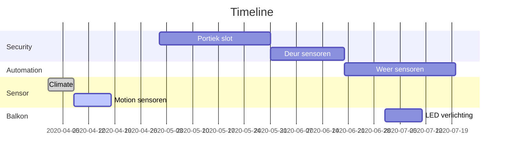
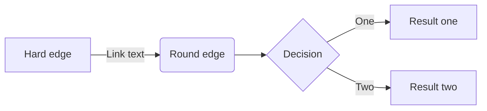

Home-Assistant
===


## Inhoud

[TOC]

## Changelog
### 2020-04-17
Gordijnen gaan automatisch open en dicht op beweging. 

## Home-assistant documentatie

De standaard engelstalige documentatie over home-assistant staat hier. Deze pagina gaat specifiek over mijn huis en is bedoeld om vragen van gebruikers te beantwoorden, en zodat ik niet alles zelf hoef te onthouden.


Project Timeline
---


> Read more about mermaid here: http://mermaid-js.github.io/mermaid/



User story
---

```gherkin=
Feature: Verlichting
  Als een bewoner
  Wil ik dat de lampen aan staan wanneer het donker is
  Omdat de lichtknoppen niet in dezelfde ruimte zijn. 

  Scenario: Bewoner loopt in de keuken
    Given Er zijn mensen thuis
    When Ik in de keuken loop
    And Het is donker
    And De lamp staat uit
    Then Zet de lamp aan
    And Reset de timer die de lamp uit zet
```

## Automations
### Woonkamer
#### Gordijnen
De gordijnen gaan open bij beweging in de woonkamer, na zonsopkomst. 
De gordijnen gaan dicht bij beweging, 30 minuten na zonsondergang. 

## Appendix and FAQ

:::info
**Find this document incomplete?** Leave a comment!
:::

###### tags: `Documentation`
